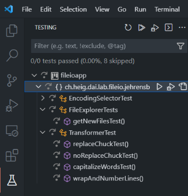
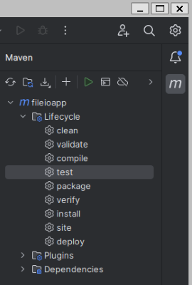

DAI Lab 2: File I/O
===================

Goals
------------------------------------------------------------------------------

The goals of this lab are:
- Java
  - Manipulate `String` objects (split, join, replace, StringBuilder, etc.).
  - Use the `java.io` API (`InputStream`, `OutputStream`, `BufferedReader`, `BufferedWriter`, etc.) to read and write data.
  - Read and write textual data using the appropriate character encoding.
  - Use the try-with-resources statement to properly close streams.
- Tools
  - Know how to JUnit to a Maven project.
  - Run Unit tests from the command line with Maven.
  - Run unit tests from an IDE.
  - Use the debugger of your IDE to debug your code.
- Git
  - Use the fork / pull request workflow.
  - Create and work in new branches.
  - Pull changes from a remote repository.

Introduction
------------------------------------------------------------------------------

In this lab you will create write a Java program that reads a text files and
performes some simple transformations on it. 

You will also create a Docker Compose infrastructure with containers that generate input files
and your program to process the files. 

Finally, you will use Git to manage your code and submit your work.

Preparation
------------------------------------------------------------------------------

> [!IMPORTANT]
> Before starting to write your program, read the document on the Git fork / pull request workflow on Cyberlearn. 

This is the workflow you will use to submit your work.

### Fork the repository

You cannot directly commit to this repository. You must there first create your own copy of the repository.

To do this, click on the "Fork" button in the top right corner of this page on GitHub. This will create a copy of the repository in your own GitHub account.

Now there are two repositories: 
* **upstream**: the original repository on the DAI organization. You cannot commit to this repository.
* **origin**: your own copy of the repository. You can commit to this repository.

Then clone your forked repository (*origin*) to your computer.

### Explore the code

    dai-lab-fileio
    ├── fileioapp
    │   ├── pom.xml
    │   └── src
    │       ├── main/java/ch/heig/dai/lab/fileio/
    │       │   ├── Main.java
    │       │   ├── jehrensb
    │       │   │   ├── EncodingSelector.java
    │       │   │   ├── FileExplorer.java
    │       │   │   ├── FileReaderWriter.java
    │       │   │   └── Transformer.java
    │       └── test/java/ch/heig/dai/lab/fileio/
    │           └── jehrensb
    │               ├── EncodingSelectorTest.java
    │               ├── FileExplorerTests.java
    │               └── TransformerTest.java
    └── README.md

The repository contains a Maven project `fileioapp`. We can see that it's a Maven project because of the `pom.xml` file.

Following the standard Maven directory layout, the project contains a `src` directory with two subdirectories: `main/java` and `test/java`:
* `main/java` for the source code of the project.
* `test/java` for the unit tests of the project.

The `main` directory contains the package `ch.heig.dai.lab.fileio` with the class `Main`. This is the main class of the project.
Inside this package there is a subpackage `ch.heig.dai.labo.fileio.jehrensb` with classes `EncodingSelector`, `FileExplorer`, `FileReaderWriter` and `Transformer`.

The `test` directory mirrors this structure. It contains unit test for some of the classes in the `ch.heig.dai.labo.fileio.jehrensb` package.

### Unit testing with Maven

The Maven `pom.xml` file is configured to run the unit tests when you build the project. If you open the file, you will see:
* The `maven-surefire-plugin` plugin: this is a plugin that runs the unit tests under the `test` directory when you build the application.
* The dependencies `org.junit` and `org.junit.jupiter`: these are the JUnit libraries that are used to write and run unit tests.

Maven automatically downloads these dependencies when you build the project for the first time.

Let's try this! Open a terminal, go into the fileioapp directory and run the following command:

```bash
mvn clean test
```

Maven should print "BUILD SUCCESS" as well as warnings in yellow that some tests have been skipped.

### Unit testing with your IDE

You can also run the unit tests from your IDE.

Open the directory `./fileioapp` in your IDE (*not* the root directory of the repository). Your IDE should recognize the project as a Maven project and import it.

 

Try running the unit tests from your IDE.

Git workflow
------------------------------------------------------------------------------

The fork / pull request workflow proceeds through the following iteration:

1. Go to the GitHub page of the upstream repository (not your fork) and create an issue for the task you want to work on. This informs the others what you are working on.
1. Sync your fork with the upstream repository. The easiest way to do this is to got to the GitHub page of your fork and click on the "Sync fork" button.
1. Switch to the main branch of your repository (*origin*), if your are not already on it: 
   `git switch main`.
1. Pull the latest changes from your repository:
    `git pull`.
1. In your terminal create a new feature branch and switch to it:
   `git branch feature-sometask`
   `git switch feature-sometask`
1. Make changes to the code.
1. Commit your changes.
   `git add .`
   `git commit -m "Some commit message"`
1. Push your changes to your respository.
   `git push`
1.  Go to the GitHub page of your fork and create a pull request from your feature branch to the main branch of the upstream repository.
1. Wait for the pull request to be reviewed.
1. If the pull request is accepted, the iteration is complete and you can start a new iteration at step 1.
1. If the pull request is rejected, correct the problems, commit and push the changes to your feature branch. The pull request will be updated automatically.

This sounds long an complicated, but it is actually quite simple. 

Let's try it. The task will be to create a new folder for you in the source code and test code of the project.

1. Go to the original repository on GitHub and create an issue for the task you want to work on: "Create folders for <your_usename_on_github>.
1. Got to your repository on GitHub and click on the "Sync fork" button.
1. In your terminal, switch to the main branch of your repository. Then create a feature branch "feature-create-folders" and switch to it. 
1. Create new folders for you:
   - In the source code folder `./fileioapp/src/main/java/ch/heig/dai/lab/fileio/` copy the folder `jehrensb` to `<your_usename_on_github>`.
   - In the test folder `./fileioapp/src/test/java/ch/heig/dai/lab/fileio/` copy the folder `jehrensb` to `<your_usename_on_github>`.
   - In the different files that you copied, you will have to update the package names to `ch.heig.dai.lab.fileio.<your_usename_on_github>`.
1. Run the unit tests to make sure that everything is still working.
   The tests for the new folders should show up and be executed without an error.
1. Add, commit and push your changes to your repository.
2. Go to the GitHub page of your fork and create a pull request.